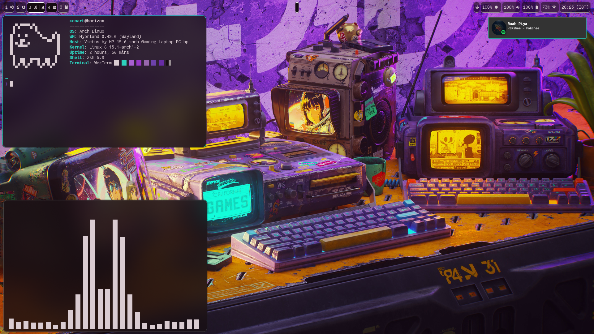

# 🎛️ Dotfiles — by conart

Hey there! I'm **conart** 👋  
These are my personal dotfiles — a minimal and clean setup I use for daily hacking and aesthetic satisfaction.

> ⚠️ These are still a work in progress. Expect updates, improvements, and better documentation soon™.

## 🖼️ Screenshot



## 📁 What's Included

- Window manager: `Hyprland`
- Status bar: `Waybar` (pywal-compatible)
- Terminal: `wezterm`, `zsh` with `starship`
- File manager: `yazi`
- Compositor: `swww`
- Theme: Fully pywal-driven
- Wallpaper daemon: `swww` + `wal`
- Browser: `zen-browser-bin`
- Logout Profiles: `wlogout`
- Terminal Info: `fastfetch`
- Notification Daemon: `swaync`
- Document Reader: `zathura`
- Menu: `rofi`

## 🔧 Features

- 🖌️ **Dynamic theming** with `pywal`
- ⚡ **Keybind-driven workflow** (Wayland-native)
- 🧊 Custom Waybar layout
- 📂 Dotfiles managed with `stow`
- 󰢍 systemd Services for Backup

## 🚀 Setup (to be expanded soon)

### Packages To Install

```bash
# To be filled in later
```

### Stowing Configuration

```bash
git clone https://github.com/yourusername/dotfiles.git
cd dotfiles
stow hypr waybar zsh kitty eww Scripts fastfetch
```

### Backup

- Add a remote `onedrive` to your cloud using `rclone` (will be extended later to be more modular)
- Start the `rclone-bisync` and `backup` services

#### Operations

Restoring from the time of snapshot with the script `backup.sh`

- [x] Install all packages (installing `paru` along the way)
- [ ] Clone dotfiles and stow them
- [ ] Start the systemctl services
- [ ] Set up the `rclone` remote and initiate the first sync
